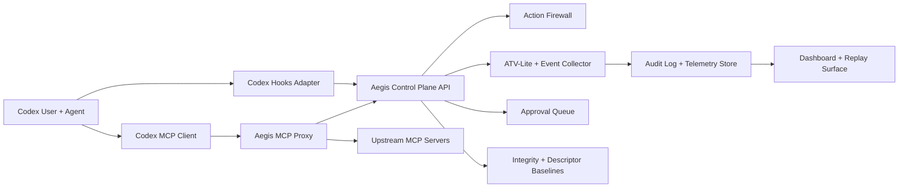

# Aegis ATV Two-Slide Brief

Use this as slide-ready source for one architecture slide and one customer/investor value slide.

## Slide 1: Architecture

### Title

Aegis ATV For Codex: Pre-Execution Trust Layer

### On-slide takeaway

Aegis sits between Codex actions and real side effects, combining hooks, MCP proxy enforcement, telemetry, approvals, and integrity baselines.

### Suggested visual

### Slide bullets

- `Codex Hooks Adapter` captures `SessionStart`, `UserPromptSubmit`, `PreToolUse`, `PermissionRequest`, `PostToolUse`, and `Stop`
- `Aegis MCP Proxy` is the hard enforcement point for MCP tool execution
- `Action Firewall` returns `allow`, `require_approval`, or `block` before side effects happen
- `ATV-Lite`, audit log, and telemetry store provide explainable evidence for every decision
- `Integrity` and `MCP descriptor baselines` block mutated config or tool-schema drift

### Speaker note

“Codex hooks give us lifecycle visibility, but the real enforcement point is the MCP proxy. Every high-risk action is checked against intent, provenance, integrity, and descriptor drift before it reaches a real side-effecting tool.”

## Slide 2: Customer And Investor Value

### Title

Why Aegis ATV Matters Now

### On-slide takeaway

This is a near-term software wedge that reduces agent risk today and expands into a larger attestation and governance platform tomorrow.

### Slide layout

#### Left column: Customer value

- Keep the existing agent runtime; add control in front of risky actions
- Stop harmful or misleading actions before execution, not after incident review
- Generate operator-ready evidence: verdict, telemetry id, audit trail, integrity state
- Route ambiguous actions into approval without breaking low-risk read paths

#### Right column: Investor value

- Runnable product behavior already maps to the patent narrative
- Software-first deployment lowers time-to-pilot and adoption friction
- Same control plane can expand into hardware attestation, privacy-preserving telemetry, and cross-tenant intelligence
- MCP proxy plus Codex hooks creates a visible wedge into enterprise agent governance

### Bottom proof points

- `Cost`: stop unnecessary side-effecting calls before spend occurs
- `Performance`: allow low-risk read flows with lightweight overhead
- `Security`: block intent divergence, config drift, and MCP descriptor drift pre-execution

### Speaker note

“For customers, the value is immediate control and evidence without replacing their stack. For investors, the value is that this is already a runnable software wedge with a credible path to a larger trust and attestation platform.”
